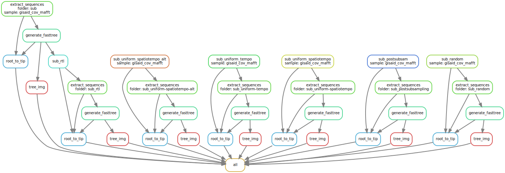

<br />
The following shows how this Snakemake workflow in this repository may be used to subsample multiple sequence alignments (e.g. SARS-CoV-2 genomes) to be more computationally manageable for phylodynamic anlaysis in BEAST2.

## Create the workflow environment

You need to install Treemmer 

## Required input files
Once having used conda to unpack & install the packaged conda environment, or once having recreated the environment with conda from the yaml recipe, the 3 requirements for performing subsampling are: 

(1.) A master alignment where headers contain calendar dates following the format 'YYYY-MM-DD'. Otherwise, subsampling can still be performed, but sequences with header dates that don't follow this format will be excluded in sampling schemes that stratify by time interval and also won't be incorporated in plotting root-to-tip divergence. For downstream analysis in BEAST2, however, all sequence headers must have dates that follow this format:

```{bash}
# Show some content of sample alignment.
head -n 2 examples/gisaid_cov_mafft.fa | cut -c 1-500
# Count number of sequences in sample alignment.
grep ">" examples/gisaid_cov_mafft.fa | wc -l
```

(2.) A list of sequence headers one per row of the sequences to include (e.g. representing a clade of interest identified from the phylogeny of the master alignment): 

```{bash}
# Show a sample list of headers.
head -n 5 examples/gisaid_cov_mafft.headers.txt
```
<center> <font size="1">

{#id .class width=50% height=50%}

</center> </font>


(3.) And a 2-column TSV file containing sequence headers and their associated location metadata in the first and second columns, respectively.

```{bash}
tail -n 5 examples/gisaid_cov_mafft.loc.tsv
```


## Display full workflow options in DAG
With these input files on hand, enter the conda environment. In an empty new working folder, generate the DAG that will display all available options:

```{bash activate_env, engine.opts='-i'}
# Enter the subsampling conda environment.
conda activate subsam-env
echo $CONDA_DEFAULT_ENV
```

```{bash setup_inputs, engine.opts='-i'}
# Create the folders "master" and "sub". 
mkdir master sub

# Place the master alignment and location metadata TSV file into the "master" folder, and place the list of headers from selected sequences into the "sub" folder.
cp examples/gisaid_cov_mafft.{fa,loc.tsv} master
cp examples/gisaid_cov_mafft.headers.txt sub
tree master sub
```

```{bash engine.opts='-i', eval = F}
# Generate full DAG of workflow. Click on the file "dag.svg" to view.
snakemake --dag | dot -Tsvg > dag.svg
```

```{bash gen_dag, engine.opts='-i', echo = F}
conda activate subsam-env
snakemake --dag | dot -Tsvg > dag.svg
```
<center> <font size="1">

{#id .class width=100% height=100%}

</center> </font>


## Run all subsampling schemes
```{bash engine.opts='-i', eval = F}
# Run snakemake with 4 cpus, according to arguments set in the config.yaml file.
snakemake --cores 4
```

```{bash run_all, engine.opts='-i', include = F}
conda activate subsam-env
snakemake --cores 4
```

```{bash view_result_all, engine.opts='-i'}
# View results from running full DAG.
tree -tr sub sub_random sub_rtl sub_uniform-tempo sub_uniform-spatiotempo sub_uniform-spatiotempo-alt sub_postsubsampling
```
<br />
*Note: If you encounter an error from treetime from the root-to-tip plotting step, stating that "Rerooting failed! No valid root found", include more sequences to increase the diversity in the tree and try again.*

Below are the generated trees and root-to-tip plots of the original selected clade, the subsample from a simple random scheme, a relative tree-length scheme, a scheme with uniform probability across time intervals, 2 schemes for uniform probability across location and time, and a scheme that groups sequences by location first then randomly samples N% of sequences from each grouping, respectively:

```{r figures, echo=FALSE}
figures <- c("sub/gisaid_cov_mafft.fasttre.nwk.png",
             "sub/gisaid_cov_mafft.rtt.png",
             "sub_random/gisaid_cov_mafft.fasttre.nwk.png",
             "sub_random/gisaid_cov_mafft.rtt.png",
             "sub_rtl/gisaid_cov_mafft.fasttre.nwk.png",
             "sub_rtl/gisaid_cov_mafft.rtt.png",
             "sub_uniform-tempo/gisaid_cov_mafft.fasttre.nwk.png",
             "sub_uniform-tempo/gisaid_cov_mafft.rtt.png",
             "sub_uniform-spatiotempo/gisaid_cov_mafft.fasttre.nwk.png",
             "sub_uniform-spatiotempo/gisaid_cov_mafft.rtt.png",
             "sub_uniform-spatiotempo-alt/gisaid_cov_mafft.fasttre.nwk.png",
             "sub_uniform-spatiotempo-alt/gisaid_cov_mafft.rtt.png",
             "sub_postsubsampling/gisaid_cov_mafft.fasttre.nwk.png",
             "sub_postsubsampling/gisaid_cov_mafft.rtt.png")
knitr::include_graphics(figures)
```
